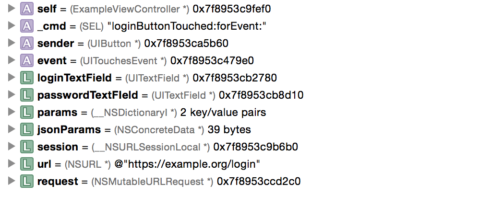
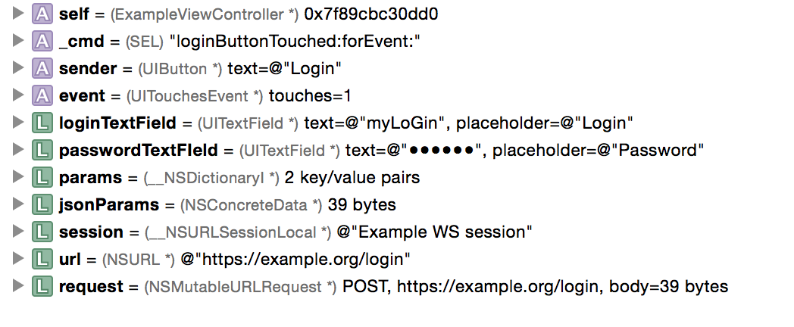

LLDB missing summaries
======================

LLDB summaries for iOS Objective-C classes.

  

    
Before:

    
  

  

  
After:

    
  

## Instalation
Clone this repository and add the following line to your __~/.lldbinit__ file. If it doesn't exist, create it.

    # ~/.lldbinit
    ...
    command script import /path/to/lldb_additions

The summaries will be available the next time Xcode starts.

## Supported summaries:
- CoreGraphics:
    - CGAffineTransform
    - CGImage
    - CGVector
- CFNetowrk:
    - CFURLRequest
    - CFURLResponse
    - NSURLConnection
    - NSURLRequest (NSMutableURLRequest)
    - NSURLResponse, NSHTTPURLResponse
    - NSURLSession
    - NSURLSessionConfiguration
    - NSURLSessionTask, NSURLSessionDataTask, NSURLSessionDownloadTask, NSURLSessionUploadTask
    - \_\_NSCFLocalDownloadFile
- Foundation:
    - NSDateComponents
    - NSLayoutConstraint
    - NSObject
    - NSOperation (NSBlockOperation)
    - NSOperationQueue
    - NSURLComponents (\_\_NSConcreteURLComponents)
    - NSUUID (\_\_NSConcreteUUID)
- QuartzCore:
    - CALayer
- UIKit:
    - UIActivityIndicatorView
    - UIAlertAction
    - UIAlertController
    - UIAlertView
    - UIBarItem / UIBarButtonItem
    - UIButton
    - UIColor / UIDeviceWhiteColor / UIDeviceRGBColor
    - UIDatePicker
    - UIEdgeInsets
    - UIEvent / UIInternalEvent / UITouchesEvent
    - UIImage
    - UIImageView
    - UILabel
    - UINavigationController
    - UINib / UINibStorage
    - UIOffset
    - UIPageControl
    - UIPickerView (Don't know what / how to show)
    - UIProgressView
    - UIScreen
    - UIScrollView
    - UISegmentedControl
    - UISlider
    - UIStepper
    - UIStoryboard
    - UIStoryboardSegue
    - UISwitch
    - UITableViewCell
    - UITextField
    - UITouch
    - UIView (UIWindow)
    - UIViewController
- StoreKit:
    - SKDownload (not tested!)
    - SKPayment
    - SKPaymentQueue
    - SKPaymentTransaction
    - SKProduct
    - SKProductsRequest
    - SKProductsResponse
    - SKReceiptRefreshRequest (doesn't return anything)
    - SKRequest

## Supported synthetic children:
- CFNetowrk:
    - NSURLRequest / NSMutableURLRequest
    - NSURLResponse, NSHTTPURLResponse
- Foundation:
    - NSDateComponents
    - NSURLComponents
- UIKit:
    - UINavigationController
    - UIDeviceWhiteColor / UIDeviceRGBColor
    - UITouchesEvent
