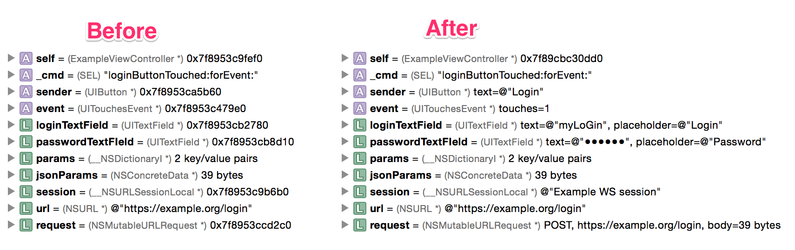

Mallet
======

LLDB additions for iOS project.

Installation
------------

PIP
^^^

.. code-block:: bash

    [sudo] pip install mallet-lldb

Add the following line to your **~/.lldbinit** file. If it doesn't exist, create it.

.. code-block:: 

    command script import mallet

GitHub
^^^^^^

.. code-block:: bash

    git clone https://github.com/bartoszj/Mallet

Add the following line to your **~/.lldbinit** file. If it doesn't exist, create it.

.. code-block:: 

    command script import /path/to/mallet/folder

Homebrew
^^^^^^^^

TBD

----

The summaries will be available the next time Xcode starts.

Configuration
-------------

By default Mallet doesn't load summaries for ``StoreKit``. If you want to load them or load any custom summaries, or configure Mallet behavior then create file **~/.lldb/mallet.yml**. You can find example in the GitHub repository.

.. code-block:: YAML

    # List of packages that should be loaded (both built in and custom).
    # StoreKit is not by default loaded.
    # Custom modules can be added by adding path to module.
    packages: 
      - StoreKit
      # - ~/path/to/custom/module

    # Turn on/off logging to file ~/Library/Logs/mallet.log. (by default false).
    # logging: true

    # Cleans log file every time mallet is loaded (by default false).
    # clean_logs: true

Custom summaries
----------------

TBD.

Supported summaries:
--------------------
- ``AFNetworking``:
    - ``AFURLConnectionOperation``
    - ``AFHTTPRequestOperation``
    - ``AFHTTPRequestOperationManager``
    - ``AFURLSessionManager``
    - ``AFHTTPSessionManager``
    - ``AFHTTPRequestSerializer``
    - ``AFJSONRequestSerializer``
    - ``AFPropertyListRequestSerializer``
    - ``AFHTTPResponseSerializer``
    - ``AFJSONResponseSerializer``
    - ``AFPropertyListResponseSerializer``
    - ``AFXMLParserResponseSerializer``
    - ``AFXMLDocumentResponseSerializer``
    - ``AFImageResponseSerializer``
    - ``AFCompoundResponseSerializer``
    - ``AFSecurityPolicy``
    - ``AFNetworkActivityIndicatorManager``
    - ``AFNetworkReachabilityManager``
- ``CoreGraphics``:
    - ``CGAffineTransform``
    - ``CGImage``
    - ``CGVector``
- ``CFNetwork``:
    - ``CFURLRequest``
    - ``CFURLResponse``
    - ``NSURLConnection``
    - ``NSURLRequest`` (``NSMutableURLRequest``)
    - ``NSURLResponse``, ``NSHTTPURLResponse``
    - ``NSURLSession``
    - ``NSURLSessionConfiguration``
    - ``NSURLSessionTask``, ``NSURLSessionDataTask``, ``NSURLSessionDownloadTask``, ``NSURLSessionUploadTask``
    - ``__NSCFLocalDownloadFile``
- ``Foundation``:
    - ``NSDateComponents``
    - ``NSLayoutConstraint``
    - ``NSObject``
    - ``NSOperation`` (``NSBlockOperation``)
    - ``NSOperationQueue``
    - ``NSURLComponents`` (``__NSConcreteURLComponents``)
    - ``NSUUID`` (``__NSConcreteUUID``)
- ``QuartzCore``:
    - ``CALayer``
- ``UIKit``:
    - ``UIActivityIndicatorView``
    - ``UIAlertAction``
    - ``UIAlertController``
    - ``UIAlertView``
    - ``UIBarItem`` / ``UIBarButtonItem``
    - ``UIButton``
    - ``UIColor`` / ``UIDeviceWhiteColor`` / ``UIDeviceRGBColor``
    - ``UIDatePicker``
    - ``UIEdgeInsets``
    - ``UIEvent`` / ``UIInternalEvent`` / ``UITouchesEvent``
    - ``UIImage``
    - ``UIImageView``
    - ``UILabel``
    - ``UINavigationController``
    - ``UINib`` / ``UINibStorage``
    - ``UIOffset``
    - ``UIPageControl``
    - ``UIPickerView`` (Don't know what / how to show)
    - ``UIProgressView``
    - ``UIScreen``
    - ``UIScrollView``
    - ``UISegmentedControl``
    - ``UISlider``
    - ``UIStepper``
    - ``UIStoryboard``
    - ``UIStoryboardSegue``
    - ``UISwitch``
    - ``UITableViewCell``
    - ``UITextField``
    - ``UITouch``
    - ``UIView`` (``UIWindow``)
    - ``UIViewController``
- ``StoreKit``:
    - ``SKDownload`` (not tested!)
    - ``SKPayment``
    - ``SKPaymentQueue``
    - ``SKPaymentTransaction``
    - ``SKProduct``
    - ``SKProductsRequest``
    - ``SKProductsResponse``
    - ``SKReceiptRefreshRequest`` (doesn't return anything)
    - ``SKRequest``

Supported synthetic children:
-----------------------------
- ``CFNetwork``:
    - ``NSURLRequest`` / ``NSMutableURLRequest``
    - ``NSURLResponse``, ``NSHTTPURLResponse``
- ``Foundation``:
    - ``NSDateComponents``
    - ``NSURLComponents``
- ``UIKit``:
    - ``UINavigationController``
    - ``UIDeviceWhiteColor`` / ``UIDeviceRGBColor``
    - ``UITouchesEvent``
